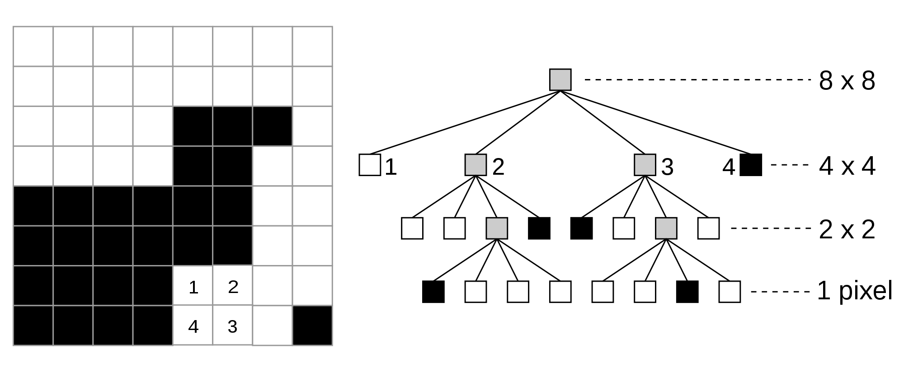

# Exam of Advanced Programming

###### 2010-03-11

## Exercise 1

The Taylor series is a representation of a function as an infinite sum of terms calculated from the values of its derivatives at a single point. They approximate a function with the following characteristics:

- The approximation is characterized by an error, this is decreasing at the increasing of the considered factors in the series, i.e., the function is more closely approximated when more addends are considered;

Taylor's series for 
$$\sin x=x-\frac{x^3}{3!}+\frac{x^5}{5!}-\frac{x^7}{7!}$$

can be implemented in Python as:

```py
def myfact(n):
    fact = 1
    for i in range(1, n+1):
        fact *= i
        if i%2 != 0: yield fact

def mysin(x, n):
    g=myfact(n)
    return sum([(x**i)/next(g) for i in range(1, n//2+1)])
```

Unfortunately, this version is bugged. Provide a test case that stress the bug and a corrected version of the program.

Note that, in our case for smaller numbers the series converges to the right value around zero but diverges when far from zero.

## Exercise 2

Scheduling is a key concept in computer multitasking, multipocessing operating system designs. Scheduling refers to the way processes are assigned to run on the available CPUs, since there are typically many more processes running than there are available CPUs. CPU scheduling deals with the problem of deciding which of the processes in the ready queue is to be allocated the CPU.

There are many different CPU scheduling alghorithms. Two of the most used are:

- **First In First Out** (FIFO) which simply queues processes in the order that they arrive in the ready queue.
- **Round-Robin** which assigns a fixed time unit per process, called CPU quantum, and cycles through them until the termination.

Let us consider a single CPU computer with a list of process to schedule. The goal of the exercise is to implement a naïve `scehduler` class whose instances will model and simulates the scheduler work with a given scheduling algorithm and a list of processes in the ready queue. A process is characterized by a name, the time to arrival in the ready queue (a non negative integer) and how long it lasts. Each process has only one operation (named `run`) which simply prints the process name, process execution is represented by the executioon of this operation: every time the process get the CPU it class `run()`. Note that the time of arrival is necessary to implement the FIFO scheduling algorithm whereas how long the process last is necessary to the round-robin algorithm. Process are all in the queue at beginning even if they have different arrival time. The class implementing the FIFO algorithm will hardwire the CPU quantum.

The assignement solution should include the `scheduler` class, two classes respectively representing the FIFO (named "`fifo`") and a round-robin (named "`round-robin`") scheduling algorithms and the process class. Note that, the easiest way to realize the two scheduling algorithms is to use iterators.

### Test example:

```py
from scheduler import *

if __name__ == "__main__":
    pl = [process("one", 10), process("two", 3, 5), process("three", 15), \
          process("four", 30, 5), process("five", 10), process("six", 6, 10), \
          process("seven", 10), process("eight", 25, 5)]
    
    print("fifo scheduling")
    s = scheduler(pl, fifo)
    s.scheduling()
    print("round-robin scheduling")
    s = scheduler(pl, round_robin)
    s.scheduling()
```

### Expected output:

```
fifo scheduling
two
six
one
five
seven
three
eight
four
round-robin scheduling
two
two
six
two
six
one
five
seven
six
three
six
six
eight
eight
eight
four
four
four
```

##### **Note**: in this example the round-robin alghorithm uses a quantum time of 2

## Exercise 3

As you should know the `itertools` module provides some combinatoric operations: `combinations`, `permutations` and `combination_with_replacement` (look at the documentation if you do not know what they do).

The power set of a set S is the set of all subsets of S including the empty set and S itself. Let us write a generator for the power set of a set and a generator for the complement of each of the above generators (namely `ccombinations`, `cpermutations`, `ccombinations_with_replacement`) in the power set of S. Note that, the order counts in permutations so the power set should contains both {A, B} and {B, A} sets.

The exercise must be solved in a functional manner (list processing, closures, comprehensions, ...) any other solution will be considered wrong.

## Exercise 4

Images can be viewed as rectangular matrices of pixels where each pixel contains the information about the color. In general, the level of details implies the size of pictures, so more and more details means larger size. As a good approximation a n\*n black and white picture needs n\*n bits (just 0 for white, 1 for black, gray is yielded by close black and white pixels) of information to be represented. Of course this could be a very large value and, above all, useless: formats as JPG reduce such a size by compacting the picture and losing some details.

A **quadtree** is a tree data structure in which each internal node has up to four children. Quadtrees are most often used to partition a two dimensional space by recursively subdiving it into four quadrants or regions.

The quadtree represents a partition of space in two dimensions by decomposing the region into four equal quadrants, subquadrants, and so on which each leaf node containing data corresponding to a specific subregion. Each node in the tree either has exactly four children, or has no children (a leaf node). The root node represents the entire image region. If the pixels in any region are not entirely blacks or whites, it is subdivided. Each leaf node represents a block of pixels that are all blacks or all whites. In the following picture you have an example of the quadtree representation:



The goal of the exercise is to implement a class `quadtree` that converts a squared black and white picture from its vectorial representation (a list of zeroes and ones respectively representing a white or black pixel) to a quadtree as described above. Moreover the class have to implement a method `count` which returns the saved space with respect to the vectorial representation. Note that, in the vectorial representation the size is the length of the vector in the quadtree representation only the leaves should be counted, the saved space is the difference of these two quantities.

### Test example:

```py
from quadtree import *

if __name__ == '__main__':
    img = [
        0, 0, 0, 0, 0, 0, 0, 0,
        0, 0, 0, 0, 0, 0, 0, 0,
        0, 0, 0, 0, 1, 1, 1, 0,
        0, 0, 0, 0, 1, 1, 0, 0,
        1, 1, 1, 1, 1, 1, 0, 0,
        1, 1, 1, 1, 1, 1, 0, 0,
        1, 1, 1, 1, 0, 0, 0, 0,
        1, 1, 1, 1, 0, 0, 0, 1
    ]

    q = quadtree(img)
    print("Image space {0}.".format(len(img)))
    print("Using a quadtree representation the saved space is {0}.".format(q.count()))
```

### Expected output:

```
The original image space is 64.
Using a quadtree representation the saved space is 48.
```