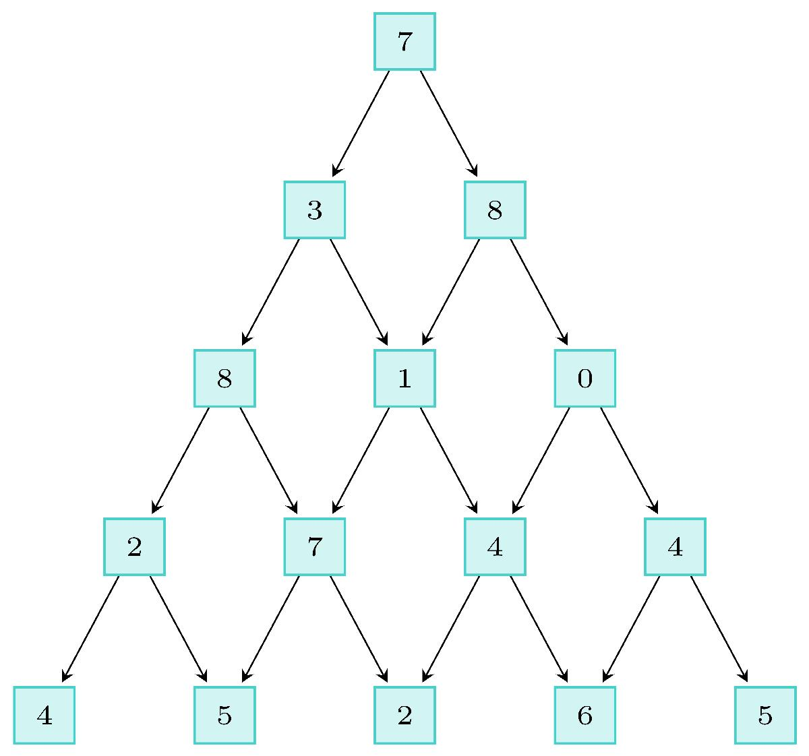

# Exam of Advanced Programming

###### 2011-03-09

## Exercise 1

Everyday we have to face some choices and each of these choices will provide a different profit (or a drawback) for us and sometimes the profit we get from a choice depends on the choices we have done before and so on. It is a really common situation to desire to get the maximum benefit from any choice we do but in everyday situation is quite impossible since we only know the past and not where out choices address us.

Let us suppose to be in an ideal situation where both past, present and future possibilities, all their interdependencies and the cost/benefit of each choice are known. Such a base of knowledge can be represented as a direct acyclic graph (for simplicity we suppose that every choice originates only and always two scenarios and each scenario can be reached by two adjacent choices) where the nodes are the choices and the edges represent the different scenarios the choice originates; the cost/benefit of the choice we do are associated to the node in the tree. The next figure represents an example of such a representation.



Given such a base of knowledge is quite easy to do the right chioice at each crossroad to maximize our final benefit (or to minimize our loss). Please note that sometimes is necessary to sacrifice something to get the maximum.

The goal of the exercise is to write a function (`maxpath`) that computes and returns the maximum benefit we can achieve from a base of knowledge as the one described above. To simplify the exercise the base of knowledge is stored per levels in a list of lists (each list contains all the nodes in a level, note that the length of the lists in adjacent levels **always** differs of one). **Note** only functional (i.e., that uses comprehensions, recursion, iterators or filter/map/reduce functions) solutions are admissible all other solutions are **automatically rejected**.

### Test example:

```py
from maxpath import maxpath

if __name__ == "__main__":
    l0 = [[7], [3,8], [8,1,0], [2,7,4,4], [4,5,2,6,5]]
    l1 = [[11], [7,32], [14,14,14], [0,1,2,3], [5,99,1,2,7], [0,25,9,45, 54,1], [99,88,77,66,55,44,33]]
    l2 = [[-3],[-7,1], [-14,-2,-10], [7,0,0, -7], [-1,1,0,1,-1], [5,-5,25,-25,-7,7]]
    l3 = [[1.2], [-1.2,3.14], [1,-1,0], [-3.14,5.7,-1,.23], [.1,-.2,.3,-.4,.5]]
    print(l0, ":-",end=' ')
    print(maxpath(l0))
    print(l1, ":-",end=' ')
    print(maxpath(l1))
    print(l2, ":-",end=' ')
    print(maxpath(l2))
    print(l3, ":-",end=' ')
    print(maxpath(l3))
```

### Expected output:

```
[[7], [3, 8], [8, 1, 0], [2, 7, 4, 4], [4, 5, 2, 6, 5]] :- 30
[[11], [7, 32], [14, 14, 14], [0, 1, 2, 3], [5, 99, 1, 2, 7], [0, 25, 9, 45, 54, 1], [99, 88, 77, 66, 55, 44, 33]] :- 270
[[-3], [-7, 1], [-14, -2, -10], [7, 0, 0, -7], [-1, 1, 0, 1, -1], [5, -5, 25, -25, -7, 7]] :- 22
[[1.2], [-1.2, 3.14], [1, -1, 0], [-3.14, 5.7, -1, 0.23], [0.1, -0.2, 0.3, -0.4, 0.5]] :- 9.34
```

## Exercise 2

In computer science one of the most difficult (if not impossible) task is to determine if a program will terminate or not before executing it. Also during the execution is not easy to see if the program is only taking too long to respond or if its computation is stuck in an infinite loop. Notwithstanding that the task is really relevant especially considering that time is money and to wait forever in front of a black screen is not admissible nowadays.

A partial solution to this problem is to limit the available resources used by a task in order to stop its execution when the resources run out. This permit to reduce the waiting time for nonterminating tasks but some result cannot be calculated if the resources are not wisely allocated to the task. The resource to be limited is the execution time and the limitation can be carried out by timing or more efficiently by counting the executed computational units (instructions).

The exercise consists of implementing a decorator that fixed a number of admissible steps (`resources`) will stop the computation when the used steps overcome the available resources. In our case, the resource limiter will have a course grain since it is quite hard to count the execution of a single statement through a decorator but quite easy to count the funcion/method calls.

### Test example:

```py
if __name__ == "__main__":
    resource = 10
    print("{0}! :- {1}".format(10,fact(10)))
    resource = 9
    try:
        print("{0}! :- {1}".format(10,fact(10)))
    except SystemExit: pass
    resource = 160
    try:
        print("fibo({0}) :- {1}".format(10,fibo(10)))
    except SystemExit: pass
    resource = 180
    print("fibo({0}) :- {1}".format(10,fibo(10)))
```

### Expected output:

```
10! :- 3628800
resources run out
resources run out
fibo(10) :- 55
```