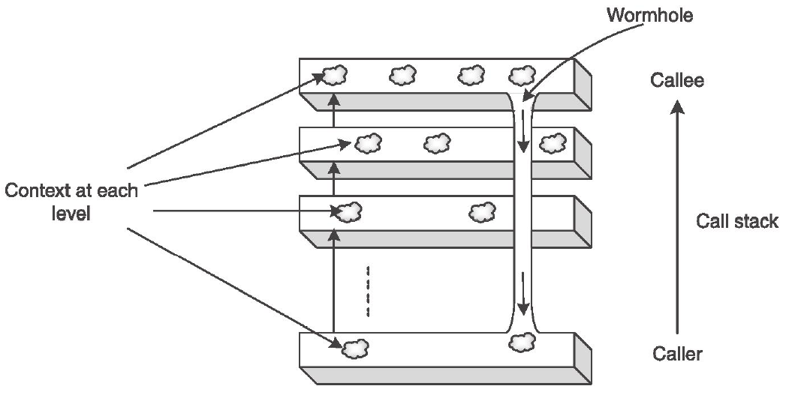

# Exam of Advanced Programming

###### 2012-06-04

## Exercise 1

Traditionally objected-oriented programming provides two different modes for cloning an instance or a structured data type: **shallow** and **deep** copy. The former has the effect to clone exclusively the external shell and not its content originating a quite fastidious **aliasing** effect. The latter, instead, copies the shell and its content recursively creating two completely separate copies of the instance.

As you know, Python's programs suffer of the aliasing effect when you copy an instance of a class or a structured type (e.g., a list) with the `=` operator. As showed in the following example:

```
>user:~/exam/ex1>python3
>>> l=[1,2,3]
>>> l1=l
>>> l1[2] = 'β'
>>> l1
[1, 2, 'β']
>>> l
[1, 2, 'β']
```

The exercise consist of defining a meta-class which implements the deep copy (the use of the `copy` module is forbidden) on the assignment operator and binding this to the standard class `list` (note the deep copy is limited to instances of the `list` class).

### Test example:

```py
from antialiasing import *

if __name__ == '__main__':
    l0=list()
    l1=list()
    l0.append(1)
    l0.append(2)
    l0.append(3)
    print("l0 :- {}".format(l0))
    l1 = l0
    print("l1 :- {}".format(l1))
    l1[0] = 'α'
    print("l0 :- {}".format(l0))
    print("l1 :- {}".format(l1))
    another_list = list()
    another_list = l1
    l1.append('Ω')
    print("l0 :- {}".format(l0))
    print("l1 :- {}".format(l1))
    print("another_list :- {}".format(another_list))
    l2 = list()
    l2.append(l0)
    l2.append(l1)
    l2.append('ζ')
    l2.append(another_list)
    print("l2 :- {}".format(l2))
    l3 = list()
    l3 = l2
    print("l3 :- {}".format(l3))
    l3[0][1] = 3.14
    del l3[3][2]
    print("l0 :- {}".format(l0))
    print("l1 :- {}".format(l1))
    print("another_list :- {}".format(another_list))
    print("l2 :- {}".format(l2))
    print("l3 :- {}".format(l3))
```

### Expected output:

```
l0 :- [1, 2, 3]
l1 :- [1, 2, 3]
l0 :- [1, 2, 3]
l1 :- ['α', 2, 3]
l0 :- [1, 2, 3]
l1 :- ['α', 2, 3, 'Ω']
another_list :- ['a', 2, 3]
l2 :- [[1, 2, 3], ['α', 2, 3, 'Ω'], 'ζ', ['α', 2, 3]]
l3 :- [[1, 2, 3], ['α'  , 2, 3, 'Ω'], 'ζ', ['α', 2, 3]]
l0 :- [1, 2, 3]
l1 :- ['α', 2, 3, 'Ω']
another_list :- ['α', 2, 3]
l2 :- [[1, 2, 3], ['α', 2, 3, 'Ω'], 'ζ', ['α', 2, 3]]
l3 :- [[1, 3.14, 3], ['α', 2, 3, 'Ω'], 'ζ', ['α', 2]]
```

## Exercise 2

Often a called method has to know the context of the invocation. As an example, let us consider an authorization system where methods has to know who called them in order to establish if the request is allowable. This particular behavior is realized by the **wormhole pattern** that allows the called method to directly access to its invoking context. This is realized by establishing a hidden and direct connection, called **wormhole**, between two levels in the call stack (as showed in the picture).



This technique does not require to modify the API in order to pass the callee context to the called method nor to introduce new calls into the existing sequence of calls. With traditional programming techniques you have just two mechanisms to realize the wormhole pattern: to add some parameters to the methods (i.e., by polluting the API) or to exploit a shared memory to store the context (i.e., by tightly coupling the program to the presence of that area). In Python, it is possible to avoid this problems by exploiting meta-classes and decorators.

Let us consider the classic example of the bank account as depicted in the following code.

- `account.py`

```py
class Account:
    def __init__(self, number, owner):
        self.tot = 0
        self.number = number
        self.owner = owner
    def deposit(self, amount):
        self.tot += amount
    def withdraw(self, amount):
        self.tot -= amount
    def balance(self):
        return self.tot
```

- `ATM.py`

```py
from wormhole import *

accounts = {
    11: Account(11, 'Walter'),
    12: Account(12, 'Cazzola'),
    13: Account(13, 'WCazzola')
}

class ATM:
    def __init__(self, idn):
        self.idn = idn
    def deposit(self, accnumber, amount):
        accounts[accnumber].deposit(amount)
    def withdraw(self, accnumber, amount):
        accounts[accnumber].withdraw(amount)
    def balance(self, accnumber):
        return accounts[accnumber].balance()
```

In this example would be nice to have the `Account` class to log all the `deposit` and `withdraw` operations when they are done. To have a complete picture of the situation the log entry should contain the id of the ATM used, the kind of operation, the number of the account interested by the operation, its owner and of course the amount of the operation. Unfourtunately, some of these data are not known to the `Account` instances, e.g., the ATM's id and this is logically correct. So implement some meta-classess and decorators combination (stored in the `wormhole.py` file) that realizes the wormhole pattern without changing the API and without using a shared memory.

### Test example:

```py
from ATM import *

if __name__ == '__main__':
    atm1 = ATM(1)
    atm2 = ATM(2)
    atm3 = ATM(3)
    
    atm1.deposit(11, 2500)
    atm2.withdraw(12, 1000)
    atm3.deposit(12, 7000)
    atm3.deposit(13, 1500)
    atm1.withdraw(11, 500)
    atm2.withdraw(13, 1500)
    atm2.deposit(11, 7000)
    atm1.deposit(13, 3500)

    for number in accounts.keys():
        print("the account #{0} contains {1}€".format(number, atm1.balance(number)))
```

**Note** that the code provided **CAN'T** be changed.

### Expected output:

```
## At the ATM1 Has been requested a «deposit» on the account 11 owned by Walter for 2500€.
## At the ATM2 Has been requested a «withdraw» on the account 12 owned by Cazzola for 1000€.     
## At the ATM3 Has been requested a «deposit» on the account 12 owned by Cazzola for 7000€.      
## At the ATM3 Has been requested a «deposit» on the account 13 owned by WCazzola for 1500€.     
## At the ATM1 Has been requested a «withdraw» on the account 11 owned by Walter for 500€.       
## At the ATM2 Has been requested a «withdraw» on the account 13 owned by WCazzola for 1500€.    
## At the ATM2 Has been requested a «deposit» on the account 11 owned by Walter for 7000€.       
## At the ATM1 Has been requested a «deposit» on the account 13 owned by WCazzola for 3500€.     
the account #11 contains 9000€
the account #12 contains 6000€
the account #13 contains 3500€
```

## Exercise 3

An **alternade** is a word in which its letters, taken alternatively in a strict sequence, and used in the same order as the original word, make up as many **real** words as the alternade length. All letters must be used, but the smaller words are not necessarily of the same length. For example, a word with seven letters where every letter is used will produce a four-letter word and a three-letter word.

In the majority of alternades, every second letter is used to make two smaller words, but in some cases, every third letter is used to make three smaller words and so on. Theoretically, a very long word could use every fourth/fifth/... letter to make four/five/... smaller words; e.g., «partitioned» is an alternade for «pin», «ate», «rid», and «to».

In this exercise is required to implement a generator, named `alternade_generator`, parametric on a dictionary filename and on hte number of the alternade, i.e., a couple word and a list of its spawns (spawned as for the rules above) checked into the dictionary that all the spawns are real words. As a dictionary use the file named `dictionary.txt` (it is already sorted do not change it).

### Test example:

```py
from alternade import *

if __name__ == "__main__":
    for i in range(2,5):
        tot = 0
        var_format = "«{0}» is an alternade for "+\
            ("«{{{}}}», "*(i-1)).format(*range(1,i))+"and «{{{}}}»".format(i)
        for w, a in alternade_generator("dictionary.txt", i):
            tot+=1
            print(var_format.format(w,*a))
        print("There are {0} alternade of lenght {1} in this dictionary\n"
                    .format(tot, i))
```

### Expected output:

```
«aids» is an alternade for «ad», and «is»
«aims» is an alternade for «am», and «is»
«allied» is an alternade for «ale», and «lid»
...
«wooded» is an alternade for «woe», and «odd»
«worry» is an alternade for «wry», and «or»
There are 235 alternade of lenght 2 in this dictionary

«abacuses» is an alternade for «ace», «bus», and «as»
«abased» is an alternade for «as», «be», and «ad»
...
«womanised» is an alternade for «was», «one», and «mid»
There are 83 alternade of lenght 3 in this dictionary

«ballyhoo» is an alternade for «by», «ah», «lo», and «lo»
«corporeal» is an alternade for «col», «or», «re», and «pa»
...
«violations» is an alternade for «van», «its», «oi», and «lo»
There are 15 alternade of lenght 4 in this dictionary
```